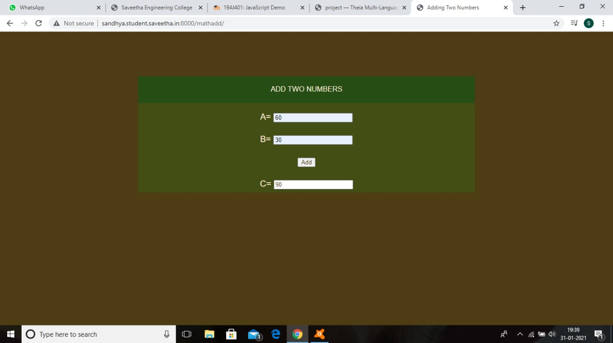
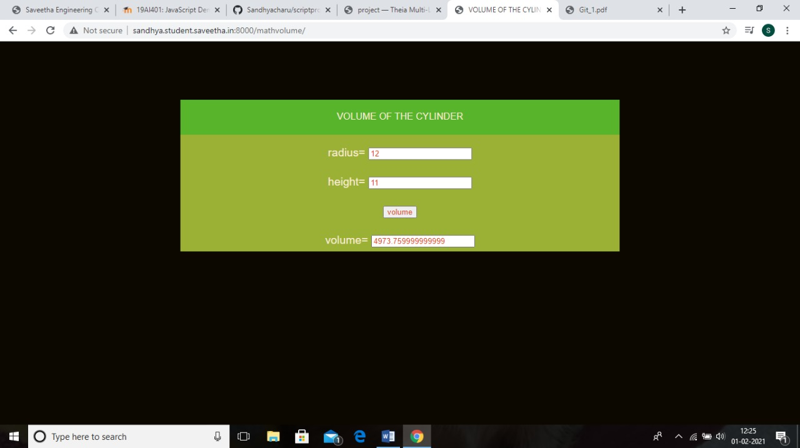
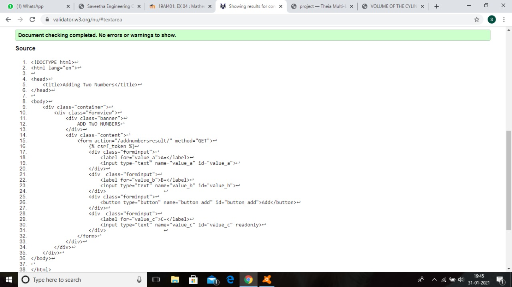

# Mathematical Calculations using JavaScript
## AIM:
To design a website to calculate the area of a circle and volume of a cylinder using JavaScript.

## DESIGN STEPS:
### Step 1: 
Requirement collection.
### Step 2:
Creating the layout using HTML and CSS.
### Step 3:
Write JavaScript to perform calculations.
### Step 4:
Choose the appropriate style and color scheme.
### Step 5:
Validate the layout in various browsers.
### Step 6:
Validate the HTML code.
### Step 6:
Publish the website in the given URL.


## PROGRAM:
### mathadd.html
```

<!DOCTYPE html>
<html>

<head>
    <title>Adding Two Numbers</title>
    <link rel="stylesheet" href="">
</head>

<body>
    <div class="container">
        <div class="formview">
            <div class="banner">
                ADD TWO NUMBERS
            </div>
            <div class="content">
                <form action="/addnumbersresult/" method="GET">
                    
                    <div class="forminput">
                        <label for="value_a">A=</label>
                        <input type="text" name="value_a" id="value_a">
                    </div>
                    <div  class="forminput">
                        <label for="value_b">B=</label>
                        <input type="text" name="value_b" id="value_b">
                    </div>                    
                    <div class="forminput">
                        <button type="button" name="button_add" id="button_add">Add</button>
                    </div>
                    <div  class="forminput">
                        <label for="value_c">C=</label>
                        <input type="text" name="value_c" id="value_c" readonly>
                    </div>                    
                </form>
            </div>
        </div>
    </div>
    <script src="/static/js/mathscript.js"></script>
</body>

</html>
```
### mathscript.css
```
*{
      box-sizing: border-box;
      font-family: Arial, Helvetica, sans-serif;
      color: antiquewhite;
}

body, html{
    margin-top: 0px;
    margin-right: 0px;
    margin-bottom: 0px;
    margin-left: 0px;
    padding-top: 0px;
    padding-right: 0px;
    padding-bottom: 0px;
    padding-left: 0px;
    background-color: rgb(12, 8, 0);
}

.container{
    width: 750px;
    margin-left: auto;
    margin-right: auto;
}

.formview{
    justify-content: center;
    margin-top: 100px; 
}

.forminput{
    height: 50px;
    padding-top: 20px;
    font-size: larger;
}

.banner{
    display: block;
    width: 100%;
    background-color: rgb(87, 180, 43);
    padding-top: 20px;
    text-align: center;
    height: 60px;
}

.content{
    display: block;
    width: 100%;
    background-color: rgb(154, 177, 53);
    text-align: center;
}

input{
    color: rgb(221, 67, 20);
}
button{
    color: rgb(218, 70, 33);
}
```
###mathscript.js
```
addbtn = document.querySelector('#button_add');

addbtn.addEventListener('click',function(e){

    TextA = document.querySelector('#value_a');
    TextB = document.querySelector('#value_b');
    TextC = document.querySelector('#value_c');

    let c;

    c = parseFloat(TextA.value) + parseFloat(TextB.value);

    TextC.value = c;
});
### mathvolume.html

```

<!DOCTYPE html>
<html>
<head>

    <title>VOLUME OF THE CYLINDER</title>
    <link rel="stylesheet" href="">
</head>
<body>

    <div class="container">

        <div class="formview">
            <div class="banner">
                VOLUME OF THE CYLINDER
            </div>
            <div class="content">
                <form action="/cylindervolumeresult/" method="GET">
                    
                    <div class="forminput">
                        <label for="value_radius">radius=</label>
                        <input type="text" name="value_radius" id="value_radius">
                    </div>
                    <div  class="forminput">
                        <label for="value_height">height=</label>
                        <input type="text" name="value_height" id="value_height">
                    </div>                    
                    <div class="forminput">
                        <button type="button" name="button_volume" id="button_volume">volume</button>
                    </div>
                     <div  class="forminput">
                        <label for="value_volume">volume=</label>
                        <input type="text" name="value_volume" id="value_volume" readonly>
                    </div> 
                </form>
            </div>
        </div>
    </div>
    <script src="/static/js/mathvolume.js"></script>
</body>
</html>

```
### mathvolume.css

```
*{
      box-sizing: border-box;
      font-family: Arial, Helvetica, sans-serif;
      color: antiquewhite;
}

body, html{
    margin-top: 0px;
    margin-right: 0px;
    margin-bottom: 0px;
    margin-left: 0px;
    padding-top: 0px;
    padding-right: 0px;
    padding-bottom: 0px;
    padding-left: 0px;
    background-color: rgb(12, 8, 0);
}

.container{
    width: 750px;
    margin-left: auto;
    margin-right: auto;
}

.formview{
    justify-content: center;
    margin-top: 100px; 
}

.forminput{
    height: 50px;
    padding-top: 20px;
    font-size: larger;
}

.banner{
    display: block;
    width: 100%;
    background-color: rgb(87, 180, 43);
    padding-top: 20px;
    text-align: center;
    height: 60px;
}

.content{
    display: block;
    width: 100%;
    background-color: rgb(154, 177, 53);
    text-align: center;
}

input{
    color: rgb(221, 67, 20);
}
button{
    color: rgb(218, 70, 33);
}
```
### mathvolume.js
```
addbtn = document.querySelector('#button_volume');

addbtn.addEventListener('click',function(e){

    TextA = document.querySelector('#value_radius');
    TextB = document.querySelector('#value_height');
    TextC = document.querySelector('#value_volume');

    let volume;

    volume = 3.14 * parseFloat(TextA.value) * parseFloat(TextA.value) * parseFloat(TextB.value);

    TextC.value = volume;
});


## OUTPUT:





## CODE VALIDATION REPORT:




## RESULT:

Thus a website is designed for the adding two numbers and is hosted in the URL http://sandhya.student.saveetha.in:8000/. HTML code is validated.

